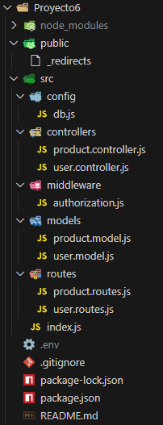
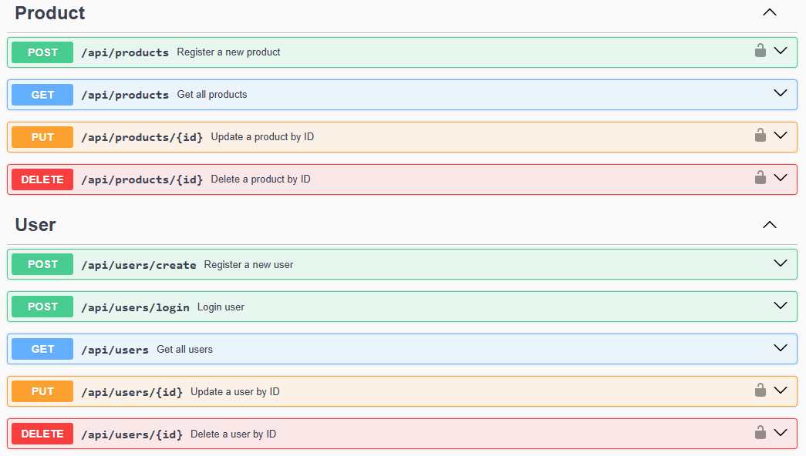

# Proyecto 6 - API REST con Node.js, Express y MongoDB

Este proyecto es una API RESTful desarrollada como parte del curso de Desarrollo Web Full Stack (DWFS), Cohorte 18 de UDD. Proporciona endpoints para gestionar usuarios y productos, con autenticación mediante JWT y documentación Swagger.

El proyecto está enfocado en una cervecería, los usuarios que les compran y los variados productos que ellos venden.

## 📦 Tecnologías y dependencias

- **Node.js**: Entorno de ejecución para JavaScript del lado del servidor.
- **Express**: Framework minimalista y flexible para aplicaciones web que proporciona un conjunto robusto de características.
- **MongoDB**: Base de datos NoSQL orientada a documentos que ofrece alto rendimiento, alta disponibilidad y escalabilidad fácil. Almacena datos en documentos flexibles similares a JSON, lo que permite esquemas dinámicos.
- **Mongoose**: ODM (Object Data Modeling) para MongoDB y Node.js que proporciona una solución basada en esquemas para modelar los datos de la aplicación.
- **bcryptjs**: Biblioteca para hashing de contraseñas, esencial para el almacenamiento seguro de credenciales.
- **jsonwebtoken (jwt)**: Estándar abierto para crear tokens de acceso que permiten la autenticación y autorización segura.
- **dotenv**: Módulo que carga variables de entorno desde un archivo .env a process.env.
- **cors**: Mecanismo que permite solicitar recursos restringidos en una página web desde un dominio diferente.
- **swagger-jsdoc**: Genera automáticamente documentación Swagger/OpenAPI a partir de comentarios JSDoc en tu código, manteniendo la documentación siempre sincronizada con la implementación real.
- **swagger-ui-express**: Sirve la interfaz interactiva de Swagger UI directamente desde tu aplicación Express, permitiendo probar los endpoints API directamente desde el navegador con una interfaz intuitiva.
- **nodemon** (dev): Herramienta esencial para desarrollo que monitorea cambios en los archivos y reinicia automáticamente el servidor Node.js, acelerando el ciclo de desarrollo al eliminar la necesidad de reinicios manuales constantes. Configurado en el script "dev" del package.json para un flujo de trabajo optimizado.

## 📁 Estructura del proyecto

## 🔐 Autenticación

El middleware authorization.js protege rutas que requieren un token JWT válido en el header.

Este middleware se encarga de verificar que:
- El encabezado Authorization esté presente.
- El token sea válido y no haya expirado.
- El formato del encabezado sea correcto:
    - Authorization: (Bearer `token` o Token `token`).

## 📄 Documentación Swagger

Accede a la documentación en: https://dwfsc18proyecto6-production.up.railway.app/api-docs/

## 🧑‍💼 Endpoints de Usuario (/api/users)

| Método | Ruta           | Descripción                        | Autenticación
| ------ | -------------- | ---------------------------------- | -------------
| POST   | `/create`      | Registrar un nuevo usuario         | ❌           
| POST   | `/login`       | Iniciar sesión y obtener token JWT | ❌           
| GET    | `/verify-user` | Verificar validez del token        | ❌           
| GET    | `/`            | Obtener todos los usuarios         | ❌           
| PUT    | `/:id`         | Actualizar un usuario por ID       | ✅           
| DELETE | `/:id`         | Eliminar un usuario por ID         | ✅           

## 📦 Endpoints de Productos (/api/products)

| Método | Ruta   | Descripción                   | Autenticación
| ------ | ------ | ----------------------------- | -------------
| POST   | `/`    | Crear un nuevo producto       | ✅           
| GET    | `/`    | Obtener todos los productos   | ❌           
| PUT    | `/:id` | Actualizar un producto por ID | ✅           
| DELETE | `/:id` | Eliminar un producto por ID   | ✅           
